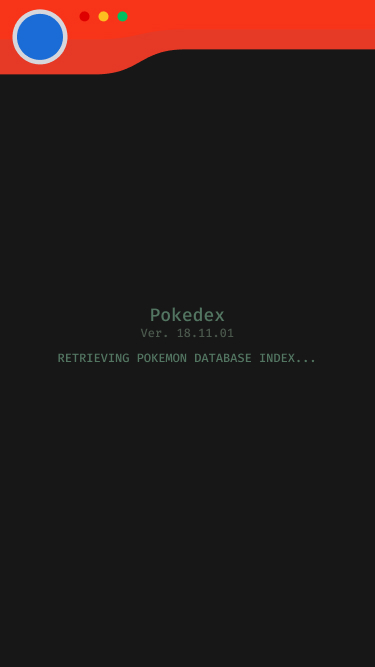
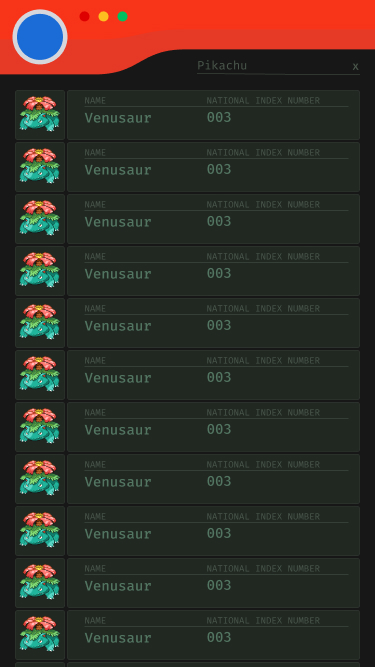
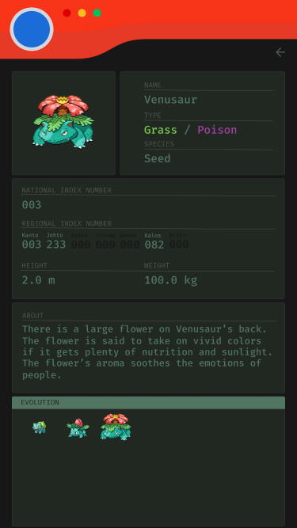

# Pokedex 

Index of all pokemon and their basic information always up to date through the use of pokeapi. Built with React and React-Router.

## About 

This was the first project I built using the React framework. My goals with this project included succesfully pulling in and parsing data from a REST api using `componentDidMount()` as well as linking and maintaining proper history state in a single page application through the use of React-Router. The subject matter of a Pokedex was chosen as it felt like a fun chance to bring in a set of consistent data (pokemon) to be displayed using a component-based mentallity I had not used until familiarizing myself with React. 

## Updates to Come

I still like the idea of a pokedex, as it is a project that I feel can be as simple or as complex as you would like to make it. I'm currently in the beginning stages of working on a refactor of my Pokedex, that will bring many improvements, some of which are:

1. **Cleaner code.** As this was my first React project, it was also my introduction to many of the new features JavaScript brought with ES6. At this point I am * *much* * more familiar with these features and can significantly reduce the code complexity through the use of them.
2. **Static Page Rendering.** Will use Gatsby to dynamically render all pages as static. Easier/better SEO and deployment.
3. **Animation / Page Transitions.** A priority as I develop more and more applications, is that the application is pleasant to use. My goal next time around with the Pokedex is to attempt to incorporate native-app style animations and page transitions. This is something I've been practicing with [as seen in this repo, for example](https://github.com/TunaSurf/hooks-and-transitions). 
4. **True to form style.** I'm attempting to create an experience that makes you feel like you are holding a real life pokedex in your hand - the one you imagined holding back in the 90's.

###### Mockups in progress

